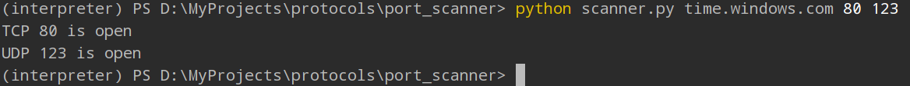
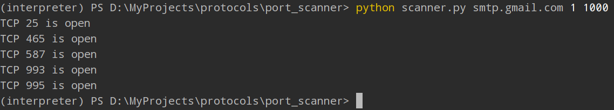

# Сканер портов

Арцыбашев Григорий КН-201

### Описание

Утилита предствляет собой сканер доступных TCP и UDP портов.
При запуске указывается хост и диапазон портов для сканирования.

### Использование

- _Запуск_:

      python scanner.py host start_port end_port

- _Для справки используйте флаг -h_:

      python scanner.py -h

### Примеры запуска

    python scanner.py localhost 20 80
    python scanner.py vk.com 80 130

### Скриншоты работы программы

